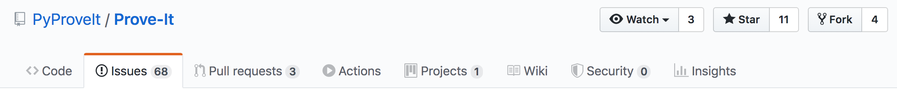
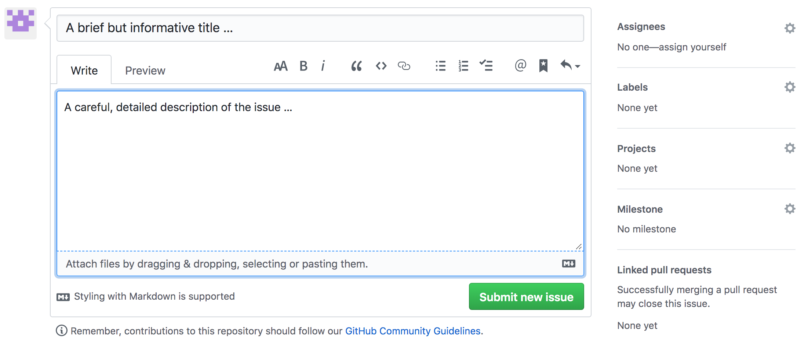

# Contributing to Prove-It

Thanks for considering contributing to Prove-It, a Python- and
Jupiter Notebook-based theorem-proving assistant.

This is a general guide for contributing to Prove-It via the project's
GitHub repository at <https://github.com/PyProveIt/Prove-It> using
issues, branches, pull requests, Kanban board, etc. This document mostly
consists of guidelines instead of hard and fast rules. After reviewing the
guidelines, use your best judgment. Feel free to propose changes to this
document via a repo issue (see the ''Creating Issues'' section below), and
feel free to make inquiries about the project and possible contributions by
contacting Wayne Witzel at wwitzel@sandia.gov.

The general workflow for everyone interacting with \<Prove-It\> is the
following:

## Contents

1. [Code of Conduct](#code-of-conduct)

1. [Python Code](#python-code)

1. [Jupyter Notebooks](#jupyter-notebooks)

1. [Cosmetic Changes](#cosmetic-changes)

1. [General Workflow](#general-workflow)

1. [Creating Issues](#creating-issues)
   
   1. [Markdown](#markdown)
   1. [Issue Template](#issue-template)
   1. [Related Issues](#related-issues)
   1. [Labels](#labels)

1. [Working Issues](#working-issues)
   1. [Planning Work](#planning-work)
   1. [When Work Begins](#when-work-begins)
   1. [As Work Continues](#as-work-continues)
      1. [Commit Messages](#commit-messages)
      1. [Doxygen](#doxygen)
   1. [When Work is Complete](#when-work-is-complete)
   1. [Closing Old Issues](#closing-old-issues)
1. [Merge Requests](#merge-requests)
   1. [Reviewers](#reviewers)
   1. [Work-in-Progress](#work-in-progress)
   1. [Merging](#merging)
   
## Code of Conduct

The Prove-It project and its participants are governed by the project's
[Code of Conduct](CODE_OF_CONDUCT.md), which helps make explicit the
expectations for a productive and respectful project community. Participants
and contributions are expected to uphold this code. Please report unacceptable
behavior to wwitzel@sandia.gov.

## Python Code

Prove-It is based on Python and all Python code should conform as much as
possible to the style and format expectations laid out in the Python
Enhancement Proposal (PEP) 8: Style Guide for Python Code, available at
<https://www.python.org/dev/peps/pep-0008/>.

## Jupyter Notebooks

Python-based Jupyter Notebooks (files with extension `.ipynb`) are used to organize axioms,
theorems, and theorem-proving. Such notebooks should …

## Cosmetic Changes

Contributions that consist solely of cosmetic changes in style or formatting,
etc., (for example, updating code format to comply with PEP8) are generally
discouraged. For some possible insights into the motivation for such a
policy, consider this related comment at the Ruby on Rails project:
<https://github.com/rails/rails/pull/13771#issuecomment-32746700>

## General Workflow

For reporting bugs, suggesting modifications, etc., you can create an issue
on the project's GitHub site or directly email Wayne Witzel at
wwitzel@sandia.gov.

For contributions in the form of python code and/or python-based Jupyter
notebooks, most of the time your general workflow will consist of
(1) creating an issue on the GitHub site; (2) establishing a corresponding
feature branch for your work; (3) managing the related Kanban board information
as you work; (4) testing your work; and (5) submitting "work in progress" (WIP)
or final pull/merge requests.

See elaborations of each of these items discussed further below. 

## Creating Issues

<div style="margin:0px 0.5in;">

[Create an issue in GitLab](https://help.github.com/en/github/managing-your-work-on-github/creating-an-issue)
for any work that needs to be done. From the
[Prove-It GitHub site](https://github.com/PyProveIt/Prove-It), select the
Issues tab:



and click on the green <b>New issue</b> button:


In the resulting submission window, supply a brief but informative title (and
realize that you will use the title in any eventual feature branch name),
and a careful, detailed comment describing the issue:



the  Newly-created issues will automatically go
in the **Open** column on the [Kanban board](https://cee-gitlab.sandia.gov/managing-your-software-project-with-gitlab/improving-quality-and-productivity/boards).

[↑ Contents](#contents)

### Markdown

Issue comments can use plain text or make use of GitHub-flavored markdown.
[Markdown](https://en.wikipedia.org/wiki/Markdown) is a lightweight markup
language with plain text formatting syntax and GitHub uses a form of it for
rendering issue and merge request descriptions and comments, and
any files in your repositories with an `.md` extension (such as this one).
For more details on what's possible with GitHub-flavored Markdown, see the
[GitHub Markdown Guide](https://guides.github.com/features/mastering-markdown/).
Be sure to use the "preview" tab in the editing window to preview your comment
and any interpreted text.

[↑ Contents](#contents)

### Issue Options: Assignees, Labels, Projects

As shown in the figure above, when creating a new issue, a number of options
appear along the right-hand side of the submission window. You can assign the
issue to one or more people (including yourself). Then select one or more
appropriate labels to classify the issue (<i>e.g.</i>, "bug", "enhancement",
<i>etc</i>.). Then under "Projects," select "development", which will
automatically add the issue to the "To Do" list on the project's Kanban board
(accessible later by selecting the Projects tab and development option) on
the project's GitHub page.

[↑ Contents](#contents)

### Related Issues

It can be very useful to indicate related issues when establishing an issue
or commenting on an already established issue. Markdown code facilitates this
by interpreting the \# symbol followed by an issue number as a link to issue.
The issue comment editing window facilitates this process by opening a pop-up
window of possible issues once you type the pound symbol #. For example, in
establishing an issue or writing a later comment on an issue, you might
realize that the issue is related to issue \#123 established earlier, and so
it's useful to add a notation such as "Related Issue: \#123", which will
eventually produce a clickable link to that related issue (which can be seen
in the preview mode by clicking on the preview tab).

[↑ Contents](#contents)

</div>

## Working Issues

<div style="margin:0px 0.25in;">

### Planning Work

As issues are created by both users and the development team, the **Open**
column on the [Kanban board](https://cee-gitlab.sandia.gov/managing-your-software-project-with-gitlab/improving-quality-and-productivity/boards)
will begin to fill up.  When determining which issues will be tackled in the
not-too-distant future, make sure the issues have enough detail in them for
work to begin, then assign them to a team member and drag them into the
"Ready to Work" column.

[↑ Contents](#contents)

### When Work Begins

Once all the necessary information has been gathered and the assignee has time
to work on an issue, it can be dragged into the "In Development" column on the
[Kanban board](https://cee-gitlab.sandia.gov/managing-your-software-project-with-gitlab/improving-quality-and-productivity/boards).
Next make sure your local `master` branch is up-to-date with
```bash
git checkout master
git pull --ff-only
```

> **Note:**  You should never be making commits on your `master` branch, as all
> changes will be making it into `master` via [merge requests](#merge-requests).
> The `--ff-only` flag ensures you only update your local `master` branch if it
> can be fast-forwarded.

Once `master` is updated, you then create a feature branch off of it with `git
checkout -b <branchName>`.  The recommended branch naming convention is to use
the issue number, following by a hyphen, followed by the issue title, all
lowercase, omitting special characters, and replacing spaces with hyphens.  For
instance, if issue number 123 has "Implement Awesome New Feature" as the title,
the corresponding branch name would be `123-implement-awesome-new-feature`.

[↑ Contents](#contents)

### As Work Continues

Do whatever work is necessary to address the issue you're tackling.  Break your
work into logical, compilable commits.  Feel free to commit small chunks of
work early and often in your local repository and then use `git rebase -i` to
reorganize your commits before sharing.

[↑ Contents](#contents)

#### Commit Messages

Make sure your commit messages reference the appropriate issue numbers using
the `#<issueNumber>` syntax.  The first line of the commit message should be a
descriptive title, limited to 50 characters.  This is then followed by a blank
line, and then the rest of the commit message is a description of the changes,
particularly why they were made, limited to 72 characters wide.

#### Doxygen

\<Project Name\> uses [Doxygen](http://www.doxygen.nl) to generate
documentation from annotated source code.  Please see [this wiki page](https://cee-gitlab.sandia.gov/managing-your-software-project-with-gitlab/improving-quality-and-productivity/wikis/Doxygen)
for our Doxygen guidelines.


[↑ Contents](#contents)

### When Work is Complete

When you think your work is finished and ready to be pushed to the remote,
you'll first want to configure, build, and test \<Project Name\> to make sure
it's all working.  Be sure to check that you haven't inserted anything that
triggers a compiler warning, and things of that nature.

While working on your feature in your local repository, other commits likely
made it into the remote `master` branch.  There are a variety of ways to merge
these changes into your local feature branch.  One possibility is
```bash
git checkout master
git pull --ff-only
git checkout <branchName>
git rebase master
```

though there are others that are equally valid.

Once that's done you'll want to configure, build, and test again to make sure
you didn't pull anything in that doesn't work with your changes.  If all is
well, go ahead and [create a merge request](#merge-requests) (see below).

[↑ Contents](#contents)

### Closing Old Issues

If at any point you encounter an issue that will not be worked in the
foreseeable future, it is worthwhile to close the issue such that we can
maintain a reasonable backlog of upcoming work.  Do be sure to include in the
comments some explanation as to why the issue won't be addressed.

[↑ Contents](#contents)

</div>

## Merge Requests

The only way changes get into `master` is through merge requests.  When you've
completed work on an issue, push your branch to the remote with
`git push -u <remoteName> <branchName>`, and then create a merge request,
selecting a template corresponding to the issue you've worked on.
On the [Kanban board](https://cee-gitlab.sandia.gov/managing-your-software-project-with-gitlab/improving-quality-and-productivity/boards), drag your issue into "Under Review".

[↑ Contents](#contents)

<div style="margin:0px 0.25in;">

### Reviewers

We recommend having your merge request reviewed by at least two other team
members.  The first should be someone who is knowledgable about the code that
you're changing&mdash;this is to make sure you don't accidentally do something
foolish.  The second should be someone who knows little about the code you're
touching&mdash;this is to spread the knowledge of how the code works throughout
the team.  Work with your reviewers to get your changes into an acceptable
state.

[↑ Contents](#contents)

### Work-in-Progress

You may wish to have your changes reviewed by colleagues before they are ready
to be merged into `master`.  To do so, create a merge request as usual, but
insert "WIP:" at the beginning of the Title.  GitLab will not allow you to
merge a WIP request.

[↑ Contents](#contents)

### Merging

When the review is finished and changes are ready to be merged into `master`:
1. Rebase your feature branch on top of the latest `master`.
1. Squash your feature branch down to a single commit.
1. Merge the request.
1. Return to the issue the merge request addressed and provide some evidence in
   a comment that the **Done Criteria** have been met.

> **Note:**  The motivation here is we want the code to build and tests to pass
> for every commit that makes it into `master`, and we'd like a history that
> is as linear as possible.  This makes finding problems with `git bisect`
> significantly easier.  However, there may be situations in which you don't
> want to squash down to a single commit.  In such a case, squash down to the
> smallest number of commits that makes sense, ensuring the code builds and
> tests pass for each commit.

[↑ Contents](#contents)

</div>